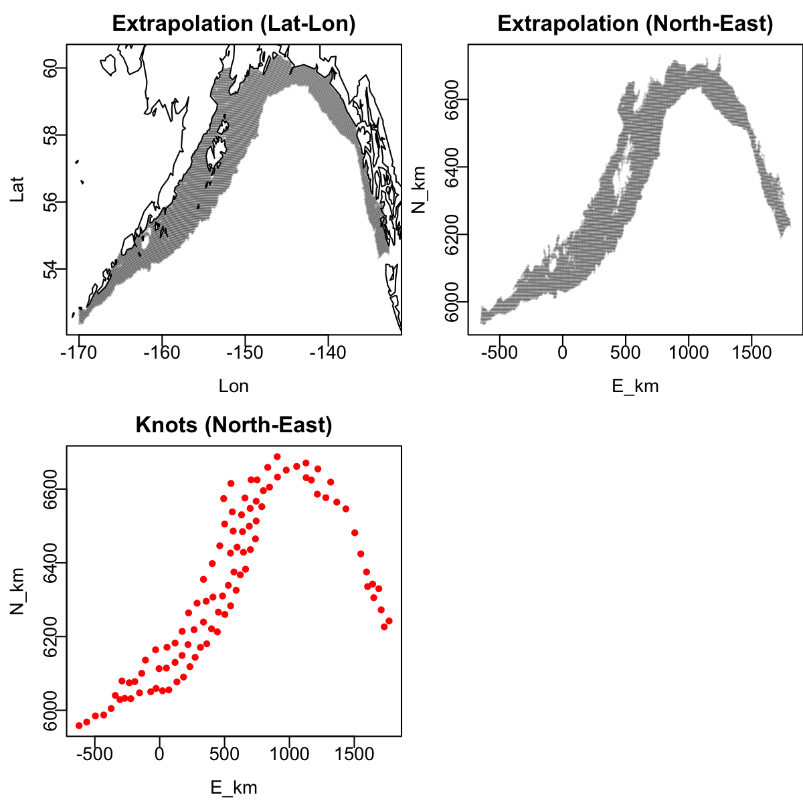
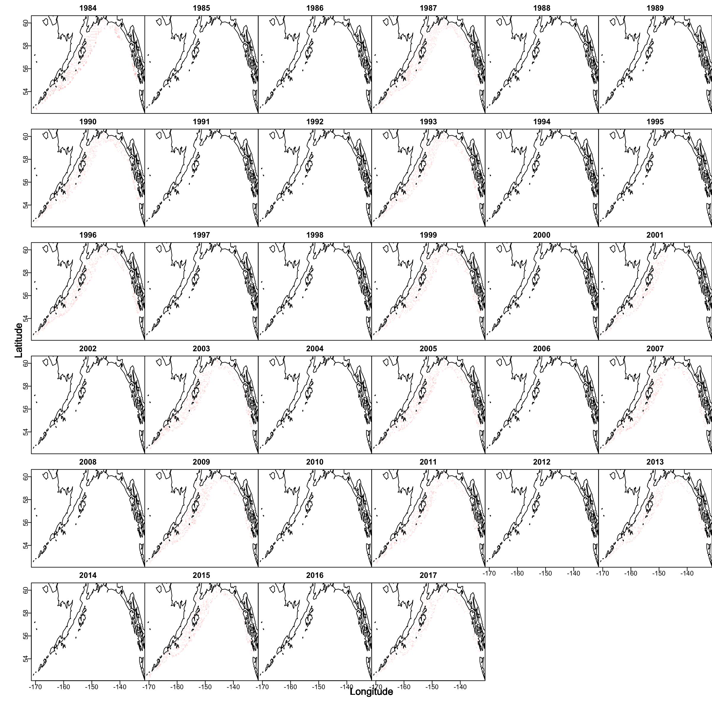
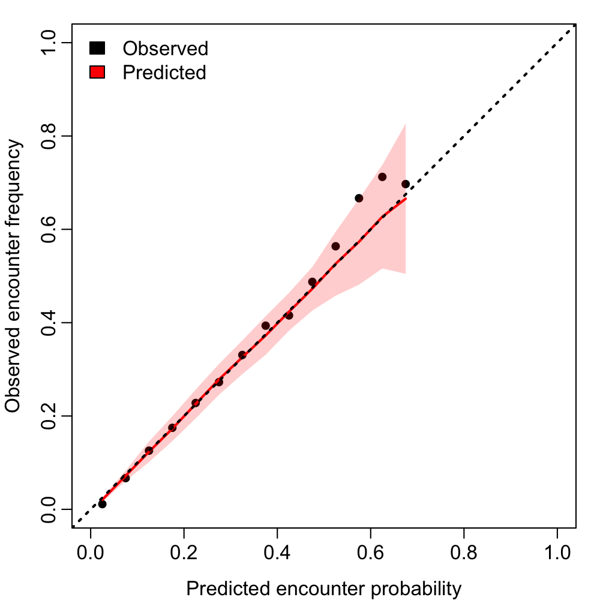
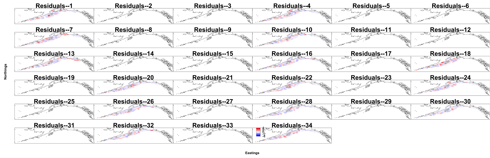
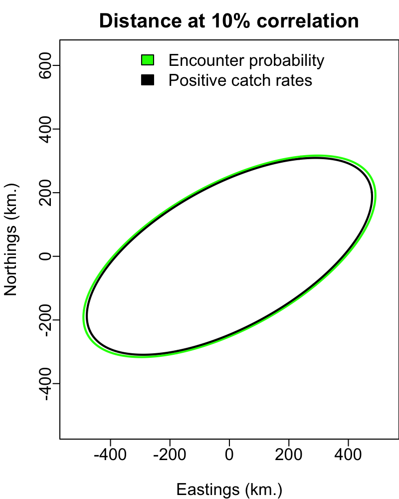
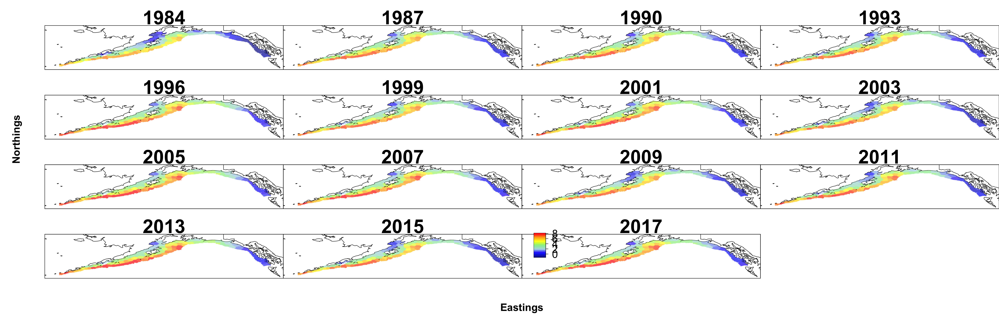
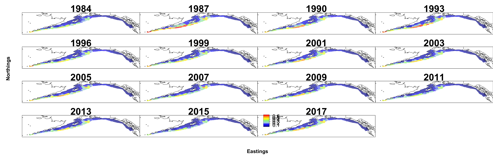
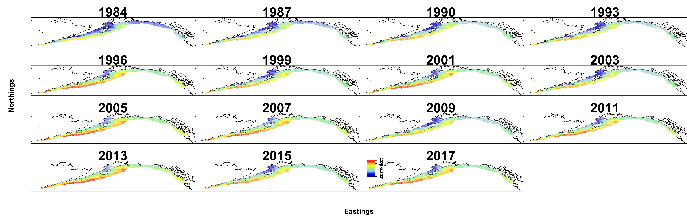
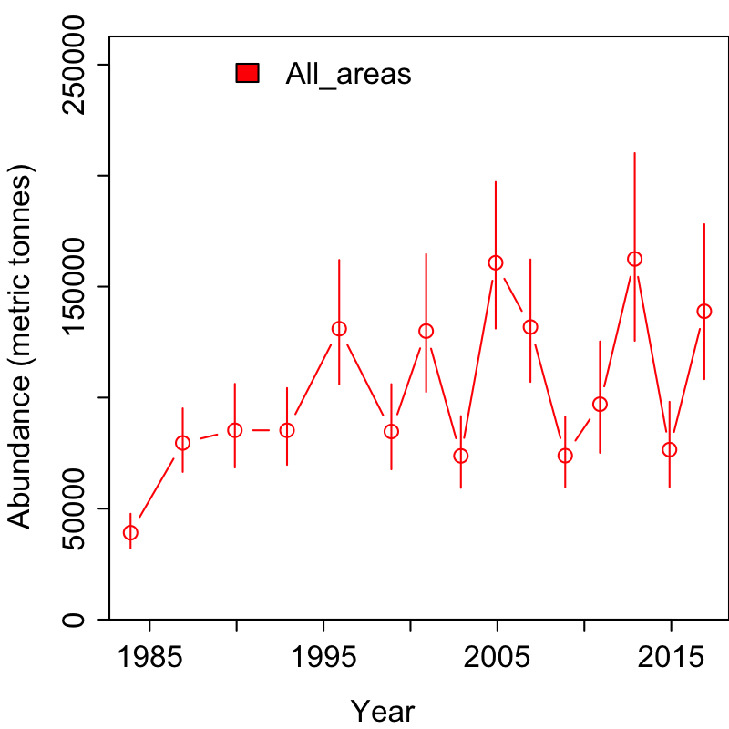
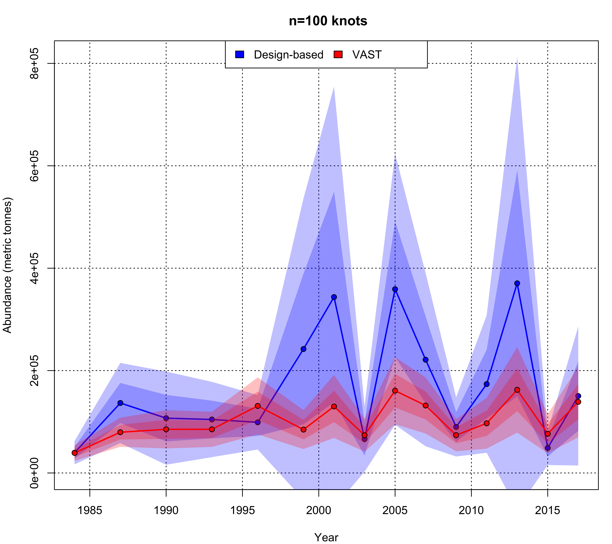

\newpage

```{r setup,include=FALSE}
install.packages("pander", repos="http://cran.us.r-project.org")
install.packages("knitr", repos="http://cran.us.r-project.org")
install.packages("kableExtra", repos="http://cran.us.r-project.org")
require(pander)
require(knitr)
require(kableExtra)

# knitr::opts_chunk$set(cache=TRUE)
options(width=50, width.cutoff=50, digits = 3) 
```

```{r wrap-hook, echo=FALSE}
# FROM: https://github.com/yihui/knitr-examples/blob/master/077-wrap-output.Rmd
library(knitr)
hook_output = knit_hooks$get('output')
knit_hooks$set(output = function(x, options) {
  # this hook is used only when the linewidth option is not NULL
  if (!is.null(n <- options$linewidth)) {
    x = knitr:::split_lines(x)
    # any lines wider than n should be wrapped
    if (any(nchar(x) > n)) x = strwrap(x, width = n)
    x = paste(x, collapse = '\n')
  }
  hook_output(x, options)
})
# TRIGGERED USING `linewidth=60`
```


#Purpose
The purpose of this document is to describe how to generate a model-based index of abundance unsing the spatio-temporal delta-GLMM in the [VAST](https://github.com/James-Thorson/VAST) package.

Specifics of this Example:

* Uses [RACE](https://www.afsc.noaa.gov/RACE/groundfish/bottom%20trawl%20surveys.php) bottom trawl survey data.
    +  Data are available from the [/data](https://github.com/curryc2/AFSC_Spatio-temporal_Workshop/tree/master/data) folder
* Single species implementation.
* Gulf of Alaska survey data.

***

#Setup

##Install required packages
```{r load_packages, message=FALSE}
devtools::install_github("nwfsc-assess/geostatistical_delta-GLMM") 
devtools::install_github("james-thorson/VAST") 
devtools::install_github("james-thorson/utilities")
install.packages("dplyr", repos="http://cran.us.r-project.org")
```

##Load required packages

```{r, warning=FALSE, message=FALSE}
require(dplyr)
require(VAST)
require(TMB)
require(FishData)
# require(tidyverse)
```

##Setup model
###Define species of interest (based on species code) and survey name.
Species are selected by defining the vector `species.codes` in combination with the `combineSpecies` variable. While most species will have a single species code, there are some examples (i.e. GOA Dusky Rockfish) that require multiple species codes to be combined for a single species index. In this later case `combineSpecies = FALSE` would be specified.

Here are some examples to choose from: 

```{r, echo=FALSE}
#Load species examples
species.examples = read.csv("Data/eval_species_list.csv", header=TRUE)
kable(species.examples)
```

Example: Northern Rockfish in the Gulf of Alaska

```{r}
species.codes = c(30420)
survey = "GOA"
```

Other `survey` variable specifications include the Eastern Bering Sea shelf survey `"EBS_SHELF"` and the Aleutian Islands survey `"AI"`.

If multiple `species.codes` need to be comined into single index, set `combineSpecies=TRUE`

```{r}
combineSpecies = FALSE
```

Next, we will define the `Region`, for spatial extrapolation.

```{r}
if(survey=="GOA") { Region = 'Gulf_of_Alaska' }
if(survey=="EBS_SHELF") { Region = "Eastern_Bering_Sea" }
if(survey=="AI") { Region = "Aleutian Islands" }
```


###Observation reference location settings
Define what location reading from survey tow will be used
Here we identify whether our spatial reference (lat/lon) for the observation will be the `"start"` or `"end"` of the survey tow.

* Note: `lat_lon.def = "start"` is usually best as in rare instances `"end"` location is not recorded.

```{r}
lat_lon.def = "start"
```

###Spatial settings
The following settings define the spatial resolution for the model (defined by number of knots `n_x`), and whether to use a grid or mesh approximation through the `Method` variable.

```{r}
Method = c("Grid", "Mesh", "Spherical_mesh")[2]
grid_size_km = 25
n_x = c(100, 250, 500, 1000, 2000)[1]
Kmeans_Config = list( "randomseed"=1, "nstart"=100, "iter.max"=1e3 )
```

###Define strata limits
Here we can define the latitude and longitude designations for strata, if strata-specific indices are desired. We will not stratify in this example.

```{r}
#Basic - Single Area
strata.limits = data.frame(STRATA = c("All_areas"))
```

###VAST version settings
Define which version of [VAST](https://github.com/James-Thorson/VAST) you will be using, i.e. which version of CPP code will be referenced for the [TMB](https://github.com/kaskr/adcomp) model.

```{r}
Version = "VAST_v4_0_0"
```

###Model settings
**Bias correction**

Define whether to implement epsilon bias correction estimator for nonlinear transformation of random effects, through the `bias.correct` variable. See [Thorson and Kristensen (2016)](https://www.sciencedirect.com/science/article/pii/S0165783615301399)

*Note: Bias correction is computationally intensive, especially for models with high spatial complexity i.e. high `n_x`.

```{r}
bias.correct = FALSE
```

**Spatio-temporal variation, autocorrelation, and overdispersion**

The following settings define whether to include spatial and spatio-temporal variation (`FieldConfig`), whether its autocorre- lated (`RhoConfig`), and whether there’s overdispersion (`OverdispersionConfig`).
In `FieldConfig`, `Omega1` and `Omega2` are `ON/OFF = 1/0` switches for spatial random effects in the **(1)** positive catch rate and **(2)** encounter probability components of the delta model. `Epsilon1` and `Epsilon2` are ON/OFF switches for the spatio-temporal random effects.
In `RhoConfig`, `Beta1` and `Beta2` are autocorrelation specifications for intercepts, while `Epsilon1` and `Epsilon2` are the same specifications for spatio-temporal random effects, for **(1)** positive catch rate and **(2)** encounter probability components of the delta model.

```{r configure model}
FieldConfig = c(Omega1 = 1, Epsilon1 = 1, Omega2 = 1, Epsilon2 = 1)
RhoConfig  = c(Beta1 = 0, Beta2 = 0, Epsilon1 = 0, Epsilon2 = 0)
OverdispersionConfig  = c(Delta1 = 0, Delta2 = 0)
```

*See documentation for `Data_Fn()` within VAST for specification of `RhoConfig` and `OverdispersionConfig`.

```{r}
?VAST::Data_Fn
```

###Observation model settings
The `ObsModel` vector is used to specify the assumed observation model, where **first** element specifies the distribution for **positive catch rates** and **second** element specifies the functional form for **encounter probabilities**.
Here we specify the conventional delta-model using logit-link for encounter probability and log-link for positive catch rates.
```{r}
ObsModel = c(1,0)
```

**Alternatives:**

`ObsModel` **Specification** | Distribution for **Positive Catch Rates**
-----------------------------|--------------------------------------------
`ObsModel[1]=0`   | Normal
`ObsModel[1]=1`   | Lognormal
`ObsModel[1]=2`   | Gamma
`ObsModel[1]=5`   | Negative binomial
`ObsModel[1]=6`   | Conway-Maxwell-Poisson (likely to be very slow)
`ObsModel[1]=7`   | Poisson (more numerically stable than negative-binomial)
`ObsModel[1]=8`   | Compound-Poisson-Gamma, where the expected number of individuals is the 1st-component, the expected biomass per individual is the 2nd-component, and SigmaM is the variance in positive catches (likely to be very slow)
`ObsModel[1]=9`   | Binned-Poisson (for use with REEF data, where 0=0 individual; 1=1 individual; 2=2:10 individuals; 3=>10 individuals)
`ObsModel[1]=10`   | Tweedie distribution, where epected biomass (lambda) is the product of 1st-component and 2nd-component, variance scalar (phi) is the 1st component, and logis-SigmaM is the power

*See documentation for `Data_Fn()` within VAST for specification of `ObsModel`.

###Save settings
**DateFile** is the folder that will hold my model outputs.

```{r, warning=FALSE}
DateFile = paste0(getwd(), "/VAST_output/")

#Create directory
dir.create(DateFile, recursive=TRUE)
```

***
##Specify model outputs
The following settings define what types of output we want to calculate.

```{r}
Options = c(SD_site_density = 0, SD_site_logdensity = 0,
            Calculate_Range = 1, Calculate_evenness = 0, Calculate_effective_area = 1,
            Calculate_Cov_SE = 0, Calculate_Synchrony = 0,
            Calculate_Coherence = 0)
```

***
#Prepare the data

* Note: This section can be replace by function `create_VAST_input()`, from `R/create-VAST-input.r`

##Load RACE data
To create the input data files for VAST model, first we must load RACE survey data.
Two data files are necessary **(1)** catch data and **(2)** haul data.

###Load data

**Catch data**

```{r}
catch = readRDS("data/race_base_catch.rds")
```

Lets see what `catch` contains...

```{r}
names(catch)
```

**Haul data**

```{r}
haul = readRDS("data/race_base_haul.rds")
```

Lets see what `haul` contains...

```{r}
names(haul)
```

Limit haul dataset to only abundance hauls

```{r}
haul = haul[haul$ABUNDANCE_HAUL=='Y',]
```

###Join datasets
We need to join haul information to catch data, creating list `catchhaul`.

```{r}
catchhaul = right_join(x=catch, y=haul, by=c("HAULJOIN"))
```

###Add in zero observations for catch weight, for no catches.
Drawing on Jim Thorson's code from [FishData](https://github.com/James-Thorson/FishData)

* Note: `species.codes` are now treated as a factor.

```{r, message=FALSE}
catchhaul.2 = FishData::add_missing_zeros(data_frame=catchhaul, unique_sample_ID_colname="HAULJOIN",
                                               sample_colname="WEIGHT", species_colname="SPECIES_CODE",
                                               species_subset=species.codes,
                                               if_multiple_records="First",
                                               Method="Fast")
```

###Attach cruise info
Cruise info is necessary to add year of survey and name
####Load cruise info

```{r}
cruise.info = read.csv("data/race_cruise_info.csv", header=TRUE, stringsAsFactors=FALSE)
```

####Attach cruise info  
We use an inner_join because it removes hauls WITHOUT identified Year and Survey

```{r}
catchhaul.3 = inner_join(x=catchhaul.2, 
                          y=cruise.info[,c("Cruise.Join.ID","Year","Survey")],
                          by=c("CRUISEJOIN.x"="Cruise.Join.ID"))
```

####Limit to survey of interest
We need to limit our dataset to only the survey of interest

```{r}
catchhaul.3 = catchhaul.3[catchhaul.3$Survey==survey,]
```

####Aggregate multiple `species.codes`
If we are combining multiple species into a single index, we need add these data together.

```{r}
if(combineSpecies==TRUE) {
  catchhaul.4 = data.frame(catchhaul.3 %>% group_by(HAULJOIN) %>% 
                              mutate('WEIGHT'=sum(WEIGHT, na.rm=TRUE)))
  #Since we have aggregated, only retain rows for 1st listed species code
  catchhaul.5 = catchhaul.4[catchhaul.4$SPECIES_CODE==species.codes[1],]
}else {
  catchhaul.5 = catchhaul.3
}
```

##Standardize data
In order to standardize the survey catch data, we must calculate effort as area swept per tow.

###Calculate effort

Input effort is in $ kilometers^2 $

```{r}
catchhaul.5$effort = catchhaul.5$NET_WIDTH*catchhaul.5$DISTANCE_FISHED/1000
```

##Add species names
First, we load the list describing both species names and `species.codes`

```{r}
species.code.data = read.csv("data/race_species_codes.csv",
                              header=TRUE, stringsAsFactors=FALSE)
```

Next, join this to our overall survey data list

```{r}
load.data = merge(x=catchhaul.5, y=species.code.data[,c("Species.Code","Common.Name")], 
                       by.x="SPECIES_CODE", by.y="Species.Code")
```

##Build `Data_Geostat`
Now, we will create the list `Data_Geostat` which is the input for the VAST model.

```{r}
Data_Geostat = NULL
```

###Add elements to `Data_Geostat` list
If you ar running for multiple species add the species name.

```{r}
if(length(species.codes) > 1) {
  Data_Geostat$spp = load.data$Common.Name
}
Data_Geostat$Catch_KG = as.numeric(load.data$WEIGHT)  
Data_Geostat$Year = as.integer(load.data$Year)
Data_Geostat$Vessel = "missing"
Data_Geostat$AreaSwept_km2 = as.numeric(load.data$effort)
Data_Geostat$Pass = 0
``` 

###Define location of samples
Depending on `lat_lon.def` specification we will either use the **start**, **end**, or **mean** location recorded for a survey haul.

* Note: Using the starting location of each haul is probably best, as: `lat_lon.def="start"`.

```{r}
if(lat_lon.def=="start") {
  Data_Geostat$Lat = load.data$START_LATITUDE
  Data_Geostat$Lon = load.data$START_LONGITUDE
}
if(lat_lon.def=="end") {
  Data_Geostat$Lat = load.data$END_LATITUDE
  Data_Geostat$Lon = load.data$END_LONGITUDE
}
if(lat_lon.def=="mean") {
  Data_Geostat$Lat = rowMeans(cbind(load.data$START_LATITUDE, 
                                     load.data$END_LATITUDE), na.rm=TRUE)
  
  Data_Geostat$Lon = rowMeans(cbind(load.data$START_LONGITUDE, 
                                     load.data$END_LONGITUDE), na.rm=TRUE)
}
```

Finally, we must ensure this `Data_Geostat` is a proper data frame.

```{r}
Data_Geostat = data.frame(Data_Geostat)
```

To double check lets see how `Data_Geostat` looks...

```{r, include=TRUE}
kable(head(Data_Geostat))
```

##Create the extrapolation grid
We also generate the extrapolation grid appropriate for a given region. For new regions, we use Region="Other".

* Note: We are not defining strata limits, but could do so based on latitude and longitude definitions.

```{r, message=FALSE, tidy=TRUE, linewidth=60}
Extrapolation_List  = SpatialDeltaGLMM::Prepare_Extrapolation_Data_Fn(Region=Region,
                                                                         strata.limits=strata.limits)
```

##Create spatial list
Next, generate the information used for conducting spatio-temporal parameter estimation, bundled in list `Spatial_List`.

```{r spatial_information, message=FALSE, warning=FALSE, tidy=TRUE, linewidth=60}
Spatial_List = SpatialDeltaGLMM::Spatial_Information_Fn(grid_size_km = grid_size_km, 
                                         n_x = n_x, Method = Method, 
                                         Lon = Data_Geostat[,"Lon"], Lat = Data_Geostat[, "Lat"],
                                         Extrapolation_List = Extrapolation_List,
                                         randomseed = Kmeans_Config[["randomseed"]],
                                         nstart = Kmeans_Config[["nstart"]],
                                         iter.max = Kmeans_Config[["iter.max"]], DirPath = DateFile,
                                         Save_Results = TRUE)
```

##Update `Data_Geostat` with knot references
We then associate each of our haul observations with its appropriate knot.

```{r}
Data_Geostat = cbind(Data_Geostat, knot_i = Spatial_List$knot_i)
```

***
#Build and run model
##Build model
To estimate parameters, we first build a list of data-inputs used for parameter estimation. Data_Fn has some simple checks for buggy inputs, but also please read the help file ?Data_Fn.

```{r, message=FALSE, tidy=TRUE}
if(length(species.codes) > 1 & combineSpecies==FALSE) {
  #MULTISPECIES
  TmbData = VAST::Data_Fn(Version=Version, FieldConfig=FieldConfig,
                    OverdispersionConfig=OverdispersionConfig,
                    RhoConfig=RhoConfig, ObsModel=ObsModel, c_i=as.numeric(Data_Geostat[,'spp'])-1,
                    b_i=Data_Geostat[,'Catch_KG'], a_i=Data_Geostat[,'AreaSwept_km2'],
                    v_i=as.numeric(Data_Geostat[,'Vessel'])-1, s_i=Data_Geostat[,'knot_i']-1,
                    t_i=Data_Geostat[,'Year'], a_xl=Spatial_List$a_xl, MeshList=Spatial_List$MeshList,
                    GridList=Spatial_List$GridList, Method=Spatial_List$Method, Options=Options )
}else {
  #SINGLE SPECIES
  TmbData = VAST::Data_Fn(Version = Version, FieldConfig = FieldConfig,
                    OverdispersionConfig = OverdispersionConfig, RhoConfig = RhoConfig,
                    ObsModel = ObsModel, c_i = rep(0, nrow(Data_Geostat)),
                    b_i = Data_Geostat[, "Catch_KG"], a_i = Data_Geostat[,"AreaSwept_km2"],
                    v_i = as.numeric(Data_Geostat[,"Vessel"]) - 1,
                    s_i = Data_Geostat[, "knot_i"] - 1, t_i = Data_Geostat[, "Year"],
                    a_xl = Spatial_List$a_xl,
                    MeshList = Spatial_List$MeshList, GridList = Spatial_List$GridList,
                    Method = Spatial_List$Method, Options = Options)
}
```

##Build TMB object
Next, we build and compile the TMB object for estimation.

* Note: Compilation may take some time... **be patient**. 

```{r, message=FALSE, results="hide", tidy=TRUE}
TmbList = VAST::Build_TMB_Fn(TmbData = TmbData, RunDir = DateFile,
                                Version = Version, RhoConfig = RhoConfig, loc_x = Spatial_List$loc_x,
                                Method = Method)
Obj = TmbList[["Obj"]]
```

###Do estimation
Fit VAST model to the data by optimizing the TMB function.

```{r, results="hide"}
Opt = TMBhelper::Optimize(obj = Obj, lower = TmbList[["Lower"]],
                          upper = TmbList[["Upper"]], getsd = TRUE, savedir = DateFile,
                          bias.correct = bias.correct, newtonsteps = 2)
```

###Save output
Save outputs from estimation

```{r}
Report = Obj$report()

Save = list("Opt"=Opt, "Report"=Report, "ParHat"=Obj$env$parList(Opt$par), 
            "TmbData"=TmbData)

save(Save, file=paste0(DateFile,"Save.RData"))
```

#Diagnostic plots

We first apply a set of standard model diagnostics to confirm that the model is reasonable and deserves further attention.  If any of these do not look reasonable, the model output should not be interpreted or used.

##Plot data

It is always good practice to conduct exploratory analysis of data.  Here, I visualize the spatial distribution of data.  Spatio-temporal models involve the assumption that the probability of sampling a given location is statistically independent of the probability distribution for the response at that location.  So if sampling "follows" changes in density, then the model is probably not appropriate!

```{r explore_data, results="hide", tidy=TRUE, message=FALSE, warning=FALSE}
SpatialDeltaGLMM::Plot_data_and_knots(Extrapolation_List=Extrapolation_List, Spatial_List=Spatial_List, Data_Geostat=Data_Geostat, PlotDir=DateFile )
```



 

\newpage

##Convergence
Here we print the diagnostics generated during parameter estimation, and confirm that (1) no parameter is hitting an upper or lower bound and (2) the final gradient for each fixed-effect is close to zero. For explanation of parameters, please see `?Data_Fn`.

```{r print_results, results="asis"}
pander::pandoc.table( Opt$diagnostics[,c('Param','Lower','MLE','Upper','final_gradient')] )
```
## Diagnostics for encounter-probability component

Next, we check whether observed encounter frequencies for either low or high probability samples are within the 95% predictive interval for predicted encounter probability
```{r diagnostics_encounter_prob, results="hide", eval=TRUE, tidy=TRUE, linewidth=50}
Enc_prob = SpatialDeltaGLMM::Check_encounter_prob( Report=Report, Data_Geostat=Data_Geostat, DirName=DateFile)
```

\newpage

##Diagnostics for positive-catch-rate component

We can visualize fit to residuals of catch-rates given encounters using a Q-Q plot.  A good Q-Q plot will have residuals along the one-to-one line.

* Note: In this plot, the red line should fall along the 1:1 line.

```{r plot_QQ, eval=TRUE, tidy=TRUE, linewidth=50, message=FALSE, warning=FALSE}
Q = SpatialDeltaGLMM::QQ_Fn( TmbData=TmbData, Report=Report, FileName_PP=paste0(DateFile,"Posterior_Predictive.jpg"), FileName_Phist=paste0(DateFile,"Posterior_Predictive-Histogram.jpg"), FileName_QQ=paste0(DateFile,"Q-Q_plot.jpg"), FileName_Qhist=paste0(DateFile,"Q-Q_hist.jpg")) 
```


\newpage

##Diagnostics for plotting residuals on a map

Finally, we visualize residuals on a map.  To do so, we first define years to plot and generate plotting inputs.
useful plots by first determining which years to plot (`Years2Include`), and labels for each plotted year (`Year_Set`).
Some general insights:

* `MapDetails_Fn` - Tries to automatically detect size of plots to do, determine what states to plot nearby.
* `Year_Set` - Range of years sampled (bookeeping)
* `Years2Include` - Years with surveys (bookeeping)

```{r plot_years}
# Get region-specific settings for plots
MapDetails_List = SpatialDeltaGLMM::MapDetails_Fn( "Region"=Region,
                                                   "NN_Extrap"=Spatial_List$PolygonList$NN_Extrap,
                                                   "Extrapolation_List"=Extrapolation_List )
# Decide which years to plot
Year_Set = seq(min(Data_Geostat[,'Year']),max(Data_Geostat[,'Year']))
Years2Include = which( Year_Set %in% sort(unique(Data_Geostat[,'Year'])))
```

We then plot Pearson residuals.  If there are visible patterns (areas with consistently positive or negative residuals accross or within years) then this is an indication of the model "overshrinking" results towards the intercept, and model results should then be treated with caution.

```{r plot_pearson_resid, message=FALSE, warning=FALSE, tidy=TRUE, linewidth=50}
SpatialDeltaGLMM:::plot_residuals(Lat_i = Data_Geostat[,"Lat"], Lon_i = Data_Geostat[, "Lon"], 
                                  TmbData = TmbData,
                                  Report = Report, Q = Q, savedir = DateFile,
                                  MappingDetails = MapDetails_List[["MappingDetails"]],
                                  PlotDF = MapDetails_List[["PlotDF"]],
                                  MapSizeRatio = MapDetails_List[["MapSizeRatio"]],
                                  Xlim = MapDetails_List[["Xlim"]], Ylim = MapDetails_List[["Ylim"]],
                                  FileName = DateFile, Year_Set = Year_Set, 
                                  Rotate = MapDetails_List[["Rotate"]], Cex = MapDetails_List[["Cex"]],
                                  Legend = MapDetails_List[["Legend"]], zone = MapDetails_List[["Zone"]],
                                  mar = c(0, 0, 2, 0), oma = c(3.5, 3.5, 0, 0), cex = 1.8)
```

**Encounter Probability Residuals**



**Catch Rate Residuals**


\newpage

## Model selection

To select among models, we recommend using the Akaike Information Criterion, AIC, via `Opt$AIC=` ``r Opt$AIC``.

# Model output

Last but not least, we generate pre-defined plots for visualizing results

## Direction of "geometric anisotropy"

We can visualize which direction has faster or slower decorrelation (termed "geometric anisotropy")
```{r plot_aniso, message=FALSE, results="hide", tidy=TRUE}
SpatialDeltaGLMM::PlotAniso_Fn( FileName=paste0(DateFile,"Aniso.png"), Report=Report, TmbData=TmbData )
```


\newpage

## Density surface for each year

We can visualize many types of output from the model.  Here I only show predicted log density, but other options are obtained via other integers passed to `plot_set` as described in `?PlotResultsOnMap_Fn`

```{r plot_density, message=FALSE, warning=FALSE, tidy=TRUE, linewidth=50}
SpatialDeltaGLMM::PlotResultsOnMap_Fn(plot_set=c(3), MappingDetails=MapDetails_List[["MappingDetails"]], Report=Report, Sdreport=Opt$SD, PlotDF=MapDetails_List[["PlotDF"]], MapSizeRatio=MapDetails_List[["MapSizeRatio"]], Xlim=MapDetails_List[["Xlim"]], Ylim=MapDetails_List[["Ylim"]], FileName=DateFile, Year_Set=Year_Set, Years2Include=Years2Include, Rotate=MapDetails_List[["Rotate"]], Cex=MapDetails_List[["Cex"]], Legend=MapDetails_List[["Legend"]], zone=MapDetails_List[["Zone"]], mar=c(0,0,2,0), oma=c(3.5,3.5,0,0), cex=1.8, plot_legend_fig=FALSE)
```


\newpage

##Encounter probability surface for each year

```{r plot_pres, message=FALSE, warning=FALSE, tidy=TRUE, linewidth=50}
SpatialDeltaGLMM::PlotResultsOnMap_Fn(plot_set=c(1), MappingDetails=MapDetails_List[["MappingDetails"]], Report=Report, Sdreport=Opt$SD, PlotDF=MapDetails_List[["PlotDF"]], MapSizeRatio=MapDetails_List[["MapSizeRatio"]], Xlim=MapDetails_List[["Xlim"]], Ylim=MapDetails_List[["Ylim"]], FileName=DateFile, Year_Set=Year_Set, Years2Include=Years2Include, Rotate=MapDetails_List[["Rotate"]], Cex=MapDetails_List[["Cex"]], Legend=MapDetails_List[["Legend"]], zone=MapDetails_List[["Zone"]], mar=c(0,0,2,0), oma=c(3.5,3.5,0,0), cex=1.8, plot_legend_fig=FALSE)
```


\newpage

##Positive catch rate surface for each year

```{r plot_catch, message=FALSE, warning=FALSE, tidy=TRUE, linewidth=50}
SpatialDeltaGLMM::PlotResultsOnMap_Fn(plot_set=c(2), MappingDetails=MapDetails_List[["MappingDetails"]], Report=Report, Sdreport=Opt$SD, PlotDF=MapDetails_List[["PlotDF"]], MapSizeRatio=MapDetails_List[["MapSizeRatio"]], Xlim=MapDetails_List[["Xlim"]], Ylim=MapDetails_List[["Ylim"]], FileName=DateFile, Year_Set=Year_Set, Years2Include=Years2Include, Rotate=MapDetails_List[["Rotate"]], Cex=MapDetails_List[["Cex"]], Legend=MapDetails_List[["Legend"]], zone=MapDetails_List[["Zone"]], mar=c(0,0,2,0), oma=c(3.5,3.5,0,0), cex=1.8, plot_legend_fig=FALSE)
```


\newpage

## Index of abundance

The index of abundance is generally most useful for stock assessment models.

```{r plot_index, message=FALSE, tidy=TRUE, linewidth=50, results="asis"}
Index = SpatialDeltaGLMM::PlotIndex_Fn( DirName=DateFile, TmbData=TmbData, Sdreport=Opt[["SD"]], Year_Set=Year_Set, Years2Include=Years2Include, strata_names=strata.limits[,1], use_biascorr=TRUE )
pander::pandoc.table( Index$Table[,c("Year","Fleet","Estimate_metric_tons","SD_log","SD_mt")] )
```



\newpage

***

#Comparing geostatistical and design-based indices
A logical next question is: How do these model-based biomass indices from VAST compare with the design-based indices we have used in the past?
To answer this question we will calculate the design-based estimates for these same survey data.
But first, we need a simple way to extract the VAST index..

##Extracting VAST index
To return the **model-based** index values directly we can use a function called `get_VAST_index()` from the [/R](https://github.com/curryc2/AFSC_Spatio-temporal_Workshop/tree/master/R) folder.
`get_VAST_index()` is a simple function to retreive [VAST](https://github.com/James-Thorson/VAST) index value and variance estimates.

* Note: This function only a simplified version of the [PlotIndex_Fn()](https://github.com/nwfsc-assess/geostatistical_delta-GLMM/blob/master/R/PlotIndex_Fn.R) function in the [SpatialDeltaGLMM](https://github.com/nwfsc-assess/geostatistical_delta-GLMM) package.


```{r}
source("R/get-VAST-index.r")
vast_est = get_VAST_index(TmbData=TmbData, Sdreport=Opt[["SD"]], bias.correct=bias.correct, Data_Geostat=Data_Geostat)
#Limit to years with observations
vast_est = vast_est[Years2Include,]
```

##Calculate design-based estimate
To return the to calculate the **desing-based** index we can use a function called `calc_design_based_index()` from the [/R](https://github.com/curryc2/AFSC_Spatio-temporal_Workshop/tree/master/R) folder, which returns the Biomass Index, Variance, SD, and CV.

`calc_design_based_index()` calls/requires the function `load_RACE_data()` from the [/R](https://github.com/curryc2/AFSC_Spatio-temporal_Workshop/tree/master/R) folder, which loads and combines the catch and trawl datasets. 

* Note: The `calc_design_based_index()` is currently only implemented for the single species case, not combining species codes or multiple species.


```{r}
source("R/load-RACE-data.R")
source("R/calc-design-based-index.R")

db_est = calc_design_based_index(species.codes=species.codes, survey=survey)
```

##Plot comparison
Lets plot a simple comparison of the indices we have estimated, with uncertainty presented shaded regions describing +1SD and +2SD.

```{r, message=FALSE,  warning=FALSE, linewidth=50}
png(paste0(DateFile,"/VAST DB Index Comparison.png"), height=8, width=9, units='in', res=500)  
  par(mfrow=c(1,1), oma=c(0,0,0,0), mar=c(4,4,3,1))
  
  y.lim = c(0, max(vast_est$Estimate_metric_tons+2*vast_est$SD_mt,
                    db_est$Biomass+2*db_est$SD))
  x.lim = c(min(Year_Set), max(Year_Set))

  #Survey years to plot
  years = Year_Set[Years2Include]
  
  #Plot it out
  plot(x=NULL, y=NULL, xlim=x.lim, ylim=y.lim, xlab='Year', ylab='Abundance (metric tonnes)',
         main=paste0(' n=', TmbData$n_x, ' knots'))
  grid(col='black')

  legend('top', legend=c('Design-based', 'VAST'), fill=c('blue', 'red'), ncol=2, bg='white')

  #Design-based
  polygon(x=c(years, rev(years)), y=c(db_est$Biomass+2*db_est$SD, rev(db_est$Biomass-2*db_est$SD)),
          border=FALSE, col=rgb(0,0,1, alpha=0.25))

  polygon(x=c(years, rev(years)), y=c(db_est$Biomass+1*db_est$SD, rev(db_est$Biomass-1*db_est$SD)),
          border=FALSE, col=rgb(0,0,1, alpha=0.25))

  lines(x=years, y=db_est$Biomass, lwd=2, col='blue')
  points(x=years, y=db_est$Biomass, pch=21, bg='blue')

  #VAST
  polygon(x=c(years, rev(years)), y=c(vast_est$Estimate_metric_tons+2*vast_est$SD_mt,
                                      rev(vast_est$Estimate_metric_tons-2*vast_est$SD_mt)),
          border=FALSE, col=rgb(1,0,0, alpha=0.25))

  polygon(x=c(years, rev(years)), y=c(vast_est$Estimate_metric_tons+1*vast_est$SD_mt, 
                                      rev(vast_est$Estimate_metric_tons-1*vast_est$SD_mt)),
          border=FALSE, col=rgb(1,0,0, alpha=0.25))

  lines(x=years, y=vast_est$Estimate_metric_tons, lwd=2, col='red')
  points(x=years, y=vast_est$Estimate_metric_tons, pch=21, bg='red')
dev.off()
```
